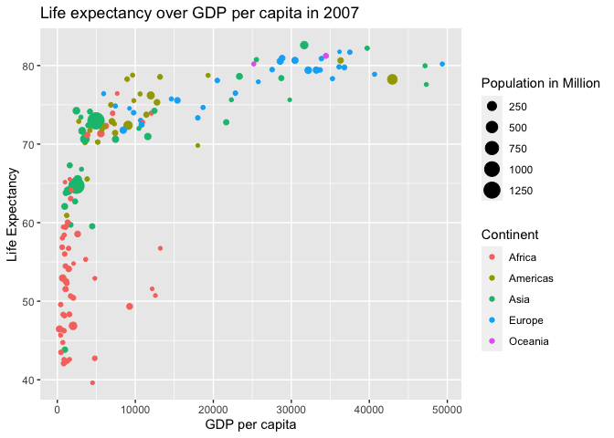

My First Github Webpage
================

## GitHub Documents

This is an R Markdown format used for publishing markdown documents to
GitHub. When you click the **Knit** button all R code chunks are run and
a markdown file (.md) suitable for publishing to GitHub is generated.

## Necessary Packages

You can include R code in the document as follows:

``` r
library(ggplot2)
library(dplyr)
```

    ## 
    ## Attaching package: 'dplyr'

    ## The following objects are masked from 'package:stats':
    ## 
    ##     filter, lag

    ## The following objects are masked from 'package:base':
    ## 
    ##     intersect, setdiff, setequal, union

``` r
library(gapminder)
```

## Figure 2.1 in Moderndive Modified

You can also embed plots, for example:

``` r
gapminder_2007 <- gapminder %>% 
  filter(year == 2007)
ggplot(data = gapminder_2007, mapping = aes(x=gdpPercap, y=lifeExp, size=pop/1000000, color = continent))+
  geom_point()+
  xlab("GDP per capita")+
  ylab("Life Expectancy")+
  labs(color="Continent", size="Population in Million")+
  ggtitle("Life expectancy over GDP per capita in 2007")
```

<!-- -->

Note that the `echo = FALSE` parameter was added to the code chunk to
prevent printing of the R code that generated the plot.
